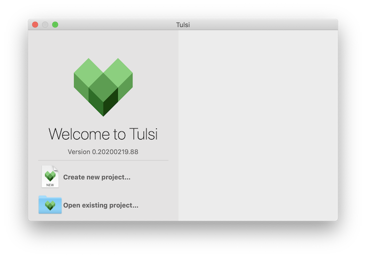

# Bazel Build Examples

[](https://travis-ci.org/larryaasen/bazelbuild_examples)

This collection of examples demonstrates how to use [Bazel](https://bazel.build/)
on iOS builds with Xcode 11 and iOS 13.

## HelloWorld

The [HelloWorld](ios/HelloWorld) iOS example is a Swift project that was
generated by Xcode 11.3.1 and remains
in the same structure as when it was generated. The project file was removed
and replaced with a Bazel build.

The [ios/HelloWorld](ios/HelloWorld) folder contains a makefile named
[Makefile.bazel](ios/HelloWorld/Makefile.bazel) that shows
the Bazel commands required to build. It also contains commands to install
and launch the build on a simulator.

To build the HelloWorld app in Bazel, install it on the simulator, and then run
the app on the simulator, run this command from the Terminal:

    $ cd ios/HelloWorld
    $ make -f Makefile.bazel build_app

## HelloWorld2

The [HelloWorld2](ios/HelloWorld2) iOS example is the same as the
[HelloWorld](#HelloWorld) example, but with a BUILD file in the subfolder HelloWorld2.

To build the HelloWorld2 app in Bazel, install it on the simulator, and then run
the app on the simulator, run this command from the Terminal:

    $ cd ios/HelloWorld2
    $ make -f Makefile.bazel build_app

## HelloWorld3

The [HelloWorld3](ios/HelloWorld3) iOS example is the same as the
[HelloWorld2](#HelloWorld2) example, but with a second swift_library containing
one new Swift file, where SwiftLib depends on library Controllers.

To build the HelloWorld3 app in Bazel, install it on the simulator, and then run
the app on the simulator, run this command from the Terminal:

    $ cd ios/HelloWorld3
    $ make -f Makefile.bazel build_app

## Bazel Commands

There are various new commands used when building with Bazel for iOS so I have
placed them in a makefile called [Makefile.bazel](ios/HelloWorld/Makefile.bazel)
so it is easy to remember how to run bazel.

First, open a Terminal window and navigate to the ios/HelloWorld2
folder.

    $ cd ios/HelloWorld2

The bazel build command used for iOS is:

    $ bazel build --apple_platform_type=ios HelloWorld2/HelloWorld2

Using make you can just type:

    $ make -f Makefile.bazel build_app

To install the app just built with bazel onto the simualator:

    $ make -f Makefile.bazel install

To run the app on the simulator:

    $ make -f Makefile.bazel launch

To build, install, and launch the app all at once:

    $ make -f Makefile.bazel run

After installing Tulsi and configuring the project, you can create the Xcode
project file from the command line. It will also launch Xcode.

    $ make -f Makefile.bazel generate_xcode_project

## Installing Tulsi

Installing [Tulsi](http://tulsi.bazel.io/) with Bazel 2.0.0 requires a few modifications to the installation script.
The script [build_and_run.sh](https://github.com/bazelbuild/tulsi) is used to build the Tulsi app and is setup to use Xcode 11.2.1 as of 3/8/2020.

To build Tulsi with Xcode 11.3.1 you need to make two changes:

* Open the [.bazelrc](https://github.com/bazelbuild/tulsi/blob/master/.bazelrc) file and
find this on line 3: `build --xcode_version=11.2.1`.
Change 11.2.1 to 11.3.1 and save the file.

* Open the WORKSPACE file and find this on line 3: `git_repository(`. Replace the
entire git_repository function with this one:
```
git_repository(
    name = "build_bazel_rules_apple",
    remote = "https://github.com/bazelbuild/rules_apple.git",
    tag = "0.19.0",
)
```

Run the build script:

    $ ./build_and_run.sh

If the build succeeded, you should see this:
```
Target //:tulsi up-to-date:
  bazel-bin/tulsi.zip
INFO: Elapsed time: 35.487s, Critical Path: 29.57s
INFO: 43 processes: 28 darwin-sandbox, 15 local.
INFO: Build completed successfully, 82 total actions
```

The Tulsi app is automatically launched:



## Contributing
All [comments](https://github.com/larryaasen/bazelbuild_examples/issues) and [pull requests](https://github.com/larryaasen/bazelbuild_examples/pulls) are welcome.

[Become a Patron!](https://www.patreon.com/bePatron?u=15315667)
